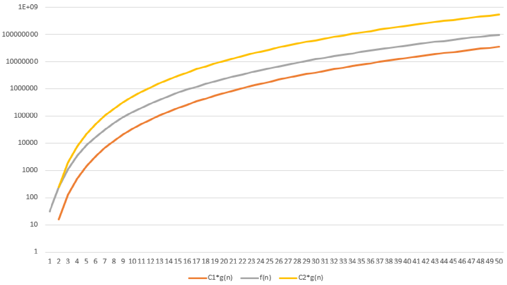

# Лабораторная работа №2.

## Задание 1. Оценка трудоемкости программы относительно умножения

### Исходный код алгоритма:

```
int r = 4;
int n, i, j, k, x, y, z, s = 0;
std::cin >> n >> z;
for (i = 1; i <= n; i++)
{
	for (j = i; j <= 2 * n; j++) //+1
	{
		for (k = 1; k <= i + j; k++)
		{
			if (z > i + j * k) //+1
			{
				s = s + k % i * j; //+1
			}
		}
	}
	for (x = 0; x <= 4 * n * n * n; x += 4) //+3
	{
		if (x < r * n) //+1
		{
			s = s + x * n; //+1
		}
		else
		{
			for (y = 7 * n * n; y > n; y /= 2) //+2
			{
				s = s * y; //+1
			}
		}
	}
}
ctd::cout << s;
```
В цикле по x мы можем точно подсчитать сколько раз выполнятся ветки if и else:
ветка if выполнится (rn/4) раз, ветка else – (n^3 – rn/4 + 1) раз.

После преобразований:
```
int r = 4;
int n, i, j, k, x, y, z, s = 0;
std::cin >> n >> z;
for (i = 1; i <= n; i++) //[1]
{
	for (j = i; j <= 2 * n; j++) //[2]
	{
		for (k = 1; k <= i + j; k++) //[3]
		{
			if (z > i + j * k) //[4]
			{
				s = s + k % i * j; //+1
			}
		} //)
	} //)
	for (x' = 0; x' < r*n/4; x' += 1) //[5]
	{
		if (x < r * n) //[6]
		{
			s = s + x * n; //+1
		}
	} //)
	for (x' = r*n/4; x' <= n^3; x' += 1) //[7]
		if (x < r * n) {} //+1
		for (y` = log2(n); y` < log2(7n^2); y += 1) //[8]
		{
				s = s * y; //+1
		} //)
	} //)
} //)
ctd::cout << s;
```

1. $+\sum_{i=1}^{n}$(
2. $+1+\sum_{j=i}^{2n}$(1
3. $+\sum_{k=1}^{i+j}$(
4. f<sub>усл</sub>(n)+max(f<sub>да</sub>(n), f<sub>нет</sub>(n)) = 2
5. $+3+\sum_{x'=0}^{\frac{rn}{4}-1}$(3
6. f<sub>усл</sub>(n)+max(f<sub>да</sub>(n), f<sub>нет</sub>(n)) = 2
7. $+\sum_{x'=\frac{rn}{4}}^{n^3}$(3
8. $+2+\sum_{y'=0}^{log2(7n)}$(

### Функция роста трудоемкости алгоритма

Исходное выражение: f(n) = $\sum_{i=1}^{n}(1+\sum_{j=i}^{2n}(1+\sum_{k=1}^{i+j}(2))+3+\sum_{x'=0}^{\frac{rn}{4}-1}(3+2)+\sum_{x'=\frac{rn}{4}}^{n^3}(3+1+2+\sum_{y'=0}^{log2(7n)}(1)))$

После преобразований: f(n) = $n^4log2(7n)+7n^4+5n^3-n^2log2(7n)+3.5n^2+nlog2(7n)+12.5n$

### Точная асимптотическая оценка



f(n) = $\Theta(n^4log(n))$, так как 

$\lim_{n \to \infty}\frac{n^4log2(7n)+7n^4+5n^3-n^2log2(7n)+3.5n^2+nlog2(7n)+12.5n}{n^4log(n)}=1$

## Задание 2. Определить функцию роста трудоемкости заданного алгоритма

### Исходный код:

```
int i, j, k, m, n, s = 0;
scanf("%d", &n);
for (i = 1; i<=(2*n); i++)
{
	j = 1;
	while (j < n - i)
	{
		for(k = 1; k < j; k++)
		{
			s = s + A[i][j][k];
		}
		j = j + 2;
	}
}
```
После преобразований:
```
int i, j, k, m, n, s = 0; //+1
scanf("%d", &n); //+4
if (n == 1 || n == 2)
{
	for (i = 1; i <= 2*n; i++) //[1]
	{
		j = 1; //+1
		if (j < n-i); //+2
	} //)
}
else if (n == 3 || n == 4)
{
	for (i = 1; i < n - 1; i++) //[2]
	{
		j = 1; //+1
		if (j < n-i); //+2
		k = 1; //+1
		if (k < j); //+1
		j = j + 2; //+2
		if (j < n-i); //+2
	} //)
	for (i = n-1; i <= 2*n; i++) //[3]
	{
		j = 1; //+1
		if (j < n-i); //+2
	} //)
}
else if (n >= 5)
{
	for (i = 1; i < n - 3; i++) //[4]
	{
		j = 0; //+1
		if (j < ⌈((n-i-1)/2)⌉); //+2
		k = 1; //+1
		if (k < 1+2j); //+1
		j = j + 1; //+2
		while (j < ⌈((n-i-1)/2)⌉) //[5]
		{
			for (k = 1; k < 1+2j; k++) //[6]
			{
				s = s + A[i][1+2j][k]; //+5
			} //)
			j = j + 1; //+2
		} //)
	} //)
	for (i = n - 3; i < n - 1; i++) //[7]
	{
		j = 1; //+1
		if (j < n - i); //+2
		k = 1; //+1
		if (k < j); //+1
		j = j + 2; //+2
		if (j < n - i); //+2
	} //)
	for (i = n-1; i <= 2*n; i++) //[8]
	{
		j = 1; //+1
		if (j < n - i); //+2
	} //)
}
```

1. $+1+2+\sum_{i=1}^{2n}$(2+1
2. $+1+2+\sum_{i=1}^{n-2}$(
3. $+\sum_{i=n-1}^{2n}$(2+1
4. $+1+2+\sum_{i=1}^{n-4}$(2+1
5. $+2+\sum_{j=1}^{⌈\frac{n-i-1}{2}⌉-1}$(2
6. $+1+1+\sum_{k=1}^{2j}$(1+1
7. $+\sum_{i=n-3}^{n-2}$(2+1
8. $+\sum_{i=n-1}^{2n}$(2+1

### Функция роста трудоемкости алгоритма

Исходное выражение:
1. При n = 1 или n = 2: f(n) = $1+4+1+2+\sum_{i=1}^{2n}(2+1+1+2)$
2. При n = 3 или n = 4: f(n) = $1+4+1+2+\sum_{i=1}^{n-2}(1+2+1+1+2+2)+\sum_{i=n-1}^{2n}(2+1+1+2)$
3. При n $\ge$ 5: f(n) = $1+4+1+2+\sum_{i=1}^{n-4}(2+1+1+2+1+1+2+2+\sum_{j=1}^{⌈\frac{n-i-1}{2}⌉-1}(2+1+1+\sum_{k=1}^{2j}(1+1+5)+2))+\sum_{i=n-3}^{n-2}(2+1+1+2+1+1+2+2)+\sum_{i=n-1}^{2n}(2+1+1+2)$

После преобразований:
1. При n = 1 или n = 2: f(n) = 8 + 12n
2. При n = 3 или n = 4: f(n) = 15n + 2
3. При n $\ge$ 5: f(n) = $\frac{14n^3-27n^2+301n-36}{24}$

## Задание 3. Определить функцию роста трудоемкости заданного алгоритма

### Исходный код алгоритма

```
int i, j, k, m, n, s = 0;
scanf("%d", &n);
for (i = 1; i <= n; i++)
{
	j = 1;
	while (j < n)
	{
		m = n;
		while (m <= n)
		{
			for (k = 1; k <= (n-2); k++)
			{
				s = s + A[i][k];
			}
			m = m + 2;
		}
		j = j * 2;
	}
}
```

После преобразований:

```
int i, j, k, m, n, s = 0; //+1
scanf("%d", &n); //+4
if (n == 1)
{
	for (i = 1; i <= 1; i++) //[1]
	{
		j = 1; //+1
		if (j < 1); //+1
	} //)
}
else if (n == 2)
{
	for (i = 1; i <= 2; i++) //[2]
	{
		j = 1; //+1
		if (j < 2); //+1
		m = n; //+1
		if (m <= n); //+1
		k = 1; //+1
		if (k <= 0); //+2
		m = m + 2; //+2
		if (m <= n); //+1
		j = j * 2; //+2
		if (j < 2); //+1
	} //)
}
else if (n >= 3)
{
	for (i = 1; i <= n; i++) //[3]
	{
		j = 0; //+1
		while (j < ⌈log2(n)⌉) //[4]
		{
			m = n; //+1
			if (m <= n); //+1
			for (k = 1; k <= (n - 2); k++) //[5]
			{
				s = s + A[i][k]; //+4
			} //)
			m = m + 2; //+2
			if (m <= n); //+1
			j++; //+2
		}//)
	} //)
}
```

1. $+1+1+\sum_{i=1}^{1}$(1+1
2. $+1+1+\sum_{i=1}^{2}$(1+1
3. $+1+1+\sum_{i=1}^{n}$(1+1
4. $+1+\sum_{j=0}^{⌈log2(n)⌉-1}$(1+
5. $+1+2+\sum_{k=1}^{n-2}$(2+1

### Функция роста трудоемкости алгоритма

Исходное выражение:
1. При n = 1: f(n) = $1+4+1+1+\sum_{i=1}^{1}(1+1+1+1)$
2. При n = 2: f(n) = $1+4+1+1+\sum_{i=1}^{2}(1+1+1+1+1+1+1+2+2+1+2+1)$
3. При n $\ge$ 3: f(n) = $1+4+1+1+\sum_{i=1}^{n}(1+1+1+1+\sum_{j=0}^{⌈log2(n)⌉-1}(1+1+1+1+2+\sum_{k=1}^{n-2}(2+1+4)+2+1+2))$

После преобразований:
1. При n = 1: f(n) = 11
2. При n = 2: f(n) = 37
3. При n $\ge$ 3: f(n) = $7n^2log2(n)-3nlog2(n)+n+7+7n^2$ 