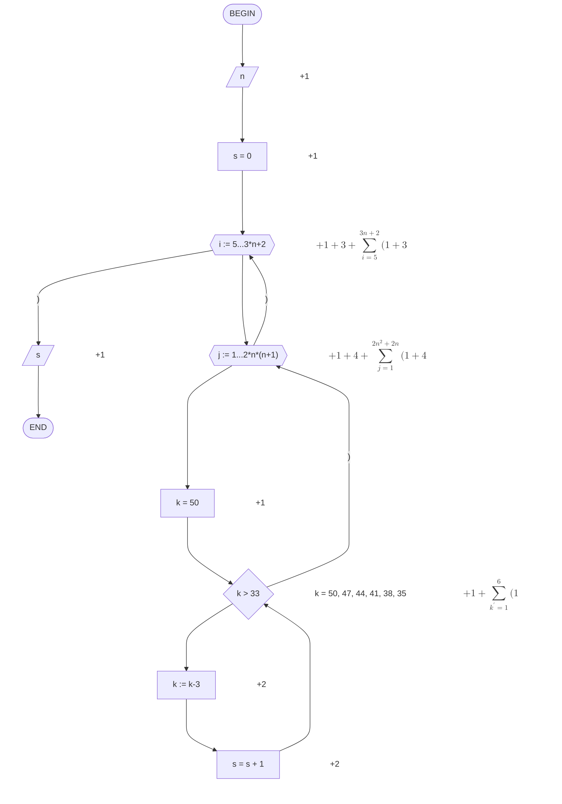
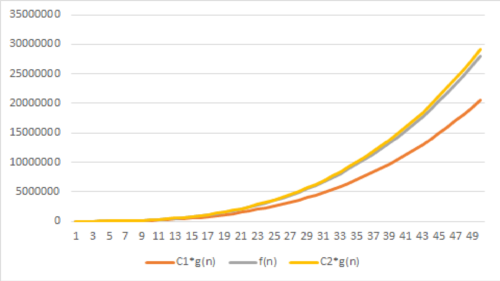

# Лабораторная работа №1. Оценка трудоемкости блок-схемы, содержащей циклы.

## Блок-схема алгоритма

## Функция роста трудоемкости алгоритма

Исходное выражение: $$f(n)=1+1+1+3+\sum_{i=5}^{3n+2}(1+3+1+4+\sum_{j=1}^{2n^2+2n}(1+4+1+1+\sum_{k`=1}^{6}(1+2+2)))+1$$
После преобразований: $$f(n)=222n^3+74n^2-121n-11$$

## Точная асимптотическая оценка

По определению: f(n) = $\Theta$(g(n)), если 0 $\le$ C1*g(n) $\le$ f(n) $\le$ C2*g(n).
Предположим, что g(n) = $n^3$, тогда 0 $\le$ C1*$n^3$ $\le$ $222n^3+74n^2-121n-11$ $\le$ C2*$n^3$.
Разделим все части неравенства на $n^3(n^3>0)$, причем C1>0, C2>0:
C1 $\le$ 222+74/n-121/$n^2$-11/$n^3$ $\le$ C2.
C(n)=222+74/n-121/$n^2$-11/$n^3$.
$C1 \in (0, min(C(n))], C2 \in [max(C(n)), +\infty)$.

C1 = 164, C2 = 232,8148148, g(n) = $n^3$.

f(n) = $\Theta$(g(n)), так как $\lim_{n \to \infty}\frac{222n^3+74n^2-121n-11}{n^3}=\lim_{n \to \infty}(222+74/n-121/n^2-11/n^3)=222$.